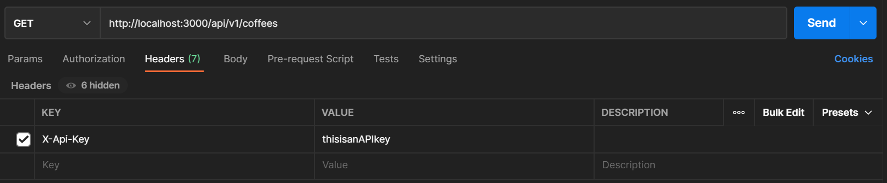

# Mean Beans API

### _This project was created solely for the education of the author(s) and is not in a complete or portfolio-ready state. It should not be considered representative of professional work._
\
[Epicodus](https://www.epicodus.com/) - [Ruby and Rails](https://www.learnhowtoprogram.com/ruby-and-rails) - [Week 6, Lesson 13](https://www.learnhowtoprogram.com/ruby-and-rails/building-an-api/building-an-api-two-day-or-one-week-project)
\
\
Date created: 2021-03-29

## Authors and Contributors
Authored by: Mekinsie Callahan, David Couch, Micah L. Olson

## Description
_Building an API: API of Choice_    
The objective of this lesson is to create a Rails API using RESTful principles, exploring the following topics:
* Building an API that includes full CRUD functionality and nested routes
* Successfully returning JSON objects via Postman and cURL
* Returning headers with the correct HTTP status code
* Testing APIs with rspec request specs
* Documenting your API endpoints
* Handling exceptions when an API call fails

## How To Make an API Call
1. clone project
2. do all the rake commands
3. create a user or something
4. open rails console and see user api key that was generated on creation
5. open some sort of API call application thing (recommend Postman)
6. start you server with "Rails S"
7
key -> Uga5LEd39Slog8OGBOhrbAtt

## Technologies
<table style="border: 0 solid transparent;">
 <tr>
    <td width=400px>
      <ul>
        <li>Ruby 2.6.5</li>
        <li>Rails 5.2.4</li>
        <li>rake 13.0.3</li>
        <li>Embedded Ruby (ERB)</li>
        <li>PostgreSQL (psql) 12.6</li>
        <li>pg 1.2.3</li>
        <li>Puma 3.12.6</li>
        <li>Bundler 1.17.2</li>
        <li>Test-Driven Development (TDD)</li>
      </ul>
    </td>
    <td width=400px>
      <ul>
        <li>Faker</li>
        <li>RSpec 3.10</li>
        <li>shoulda-matchers 4.5.1</li>
        <li>Pry 0.14.0</li>
        <li>git 2.30.1</li>
        <li>FactoryBot</li>
      </ul>
    </td>
 </tr>
</table>

## How to make API calls

**To see a list of all existing coffees:**  
1. Make a GET request using the URL: http://localhost:3000/api/v1/coffees
2. In order to make a successful api call, you must pass your api key into the header of the call. 
3. Type "X-Api-Key" into the first key input box and then paste your api key in the value input box.
Example using the <a href="https://www.postman.com/">Postman</a> app:  


You should see a JSON response with all of the coffees with the parameters "blend_name", "origin", and "notes".

**To see a single coffee value based on its id:**  
1. Make a GET request using the URL: http://localhost:3000/api/v1/coffees/:id with :id being some integer value (ex: 1,2 or 3)
2. Make sure to add your API key in the call, covered in the previous steps.

You should see a JSON response with a single coffee with the parameters "blend_name", "origin", and "notes".


## Response Examples
```
GET    /api/v1/coffees    api/v1/coffees#index
  status: 200
[
    {
        "id": 4,
        "blend_name": "Huggy Bean",
        "origin": "Cerrado, Brazil",
        "notes": "tart, round, lemon verbena, walnut, lychee",
        "created_at": "2021-03-29T16:49:32.803Z",
        "updated_at": "2021-03-29T16:49:32.803Z"
    },
    {
        "id": 6,
        "blend_name": "Kreb-Full-o Coffee",
        "origin": "Kirinyaga, Kenya",
        "notes": "quick, syrupy, watermelon, cola, green grape",
        "created_at": "2021-03-29T16:49:32.810Z",
        "updated_at": "2021-03-29T16:49:32.810Z"
    }
]

POST   /api/v1/coffees     api/v1/coffees#create

  params: blend_name, origin, notes

  your post values: {
    "blend_name": "Really Good",
    "origin": "Good Town",
    "notes": "Honestly Greate"
  }

  your response:

  status 201
  {
    "message": "You have successfully created a coffee",
    "coffee": {
        "id": 27,
        "blend_name": "Really Good",
        "origin": "Good Town",
        "notes": "Honestly Great",
        "created_at": "2021-03-30T23:01:10.519Z",
        "updated_at": "2021-03-30T23:01:10.519Z"
    }
  }

GET    /api/v1/coffees/:id api/v1/coffees#show

  http://localhost:3000/api/v1/coffees/9

  Status 200: OK
  {
      "id": 9,
      "blend_name": "Summer Delight",
      "origin": "Limu, Ethiopia",
      "notes": "pointed, coating, sage, cranberry, smokey",
      "created_at": "2021-03-29T16:49:32.820Z",
      "updated_at": "2021-03-29T16:49:32.820Z"
  }

PATCH  /api/v1/coffees/:id api/v1/coffees#update
PUT    /api/v1/coffees/:id api/v1/coffees#update

DELETE /api/v1/coffees/:id api/v1/coffees#destroy
  http://localhost:3000/api/v1/coffees/13
  Status 200: OK
  {
    "message": "You have successfully deleted the coffee with id 13"
  }

GET    /api/v1/search      api/v1/coffees#search
  http://localhost:3000/api/v1/search?q=hug
  Status 200: OK
  {
      "id": 4,
      "blend_name": "Huggy Bean",
      "origin": "Cerrado, Brazil",
      "notes": "tart, round, lemon verbena, walnut, lychee",
      "created_at": "2021-03-29T16:49:32.803Z",
      "updated_at": "2021-03-29T16:49:32.803Z"
  }
```


## License
[GPLv3](https://choosealicense.com/licenses/gpl-3.0/)  
Copyright &copy; 2021 Mekinsie Callahan, David Couch, Micah L. Olson  

## Contact
mekinsie.aja@gmail.com  
dcouch440@gmail.com  
micah.olson@protonmail.com